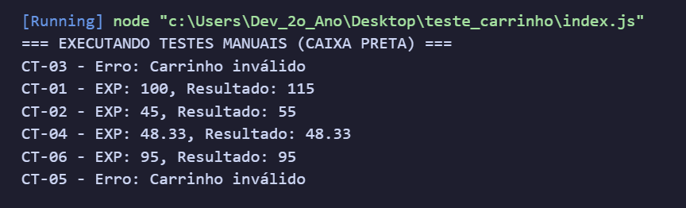

# Plano de Testes de Software & GOT

<p align="center">
  
  
  
  <br>
  
  
  
  
</p>

---

## O que é este projeto?

Este projeto é um exercício de **Engenharia de Testes de Software**, focado na elaboração de um **Plano de Testes** e de uma **Matriz do GOT (Guia de Ordem de Testes)** aplicados sobre o módulo de **Checkout de um e-commerce**.

O código-fonte (`carrinho.js`) representa o gabarito do professor/aluno: uma função `calcularTotal(itens, cupom)` propositalmente **defeituosa**, usada para treinar a capacidade de encontrar bugs através de **testes de caixa preta** (testando apenas entradas e saídas, sem olhar a lógica interna antes de escrever os casos).

Projeto desenvolvido como **exercício acadêmico/portfólio pessoal**, demonstrando domínio de planejamento de testes, rastreabilidade de casos de teste e análise de divergências entre resultado esperado x resultado obtido.

---

## O que ele entrega?

### Documentação (`docs/`)
- **Plano de Testes de Software & GOT** (`.docx`) contendo:
  - Identificação do projeto (sistema, versão, responsável, ambiente)
  - Escopo e estratégia de teste
  - Regras de negócio documentadas
  - Matriz de rastreabilidade do GOT (ID, cenário, dados de entrada, resultado esperado x obtido)
  - Tabela final de status (Passou / Falhou / Divergência)

### Código de teste (`index.js` + `carrinho.js`)
- **6 casos de teste manuais (CT-01 a CT-06)** executados em caixa preta via `console.log`
- Função `calcularTotal` com **bugs propositais** para validar se os casos de teste realmente detectam falhas de regra de negócio

---

## Regras de negócio do sistema

A função `calcularTotal(itens, cupom)` deveria seguir as seguintes regras:

- **Cálculo de subtotal:** multiplicar quantidade × preço de cada item.
- **Validação de entrada:** se o carrinho estiver vazio (`[]`), se algum item tiver quantidade `<= 0` ou preço negativo, a função deve lançar o erro `"Carrinho inválido"`.
- **Desconto de cupom:** se o cupom for `"PROMO10"`, aplicar **10% de desconto** sobre o subtotal.
- **Regra de frete:**
  - Subtotal **>= R$ 100,00** → frete **grátis** (R$ 0,00);
  - Subtotal **< R$ 100,00** → frete de **R$ 15,00**.
- **Arredondamento:** o valor total final deve ter exatamente **2 casas decimais**.

---

## Matriz do GOT — Casos de Teste

| ID | Cenário / Regra | Dados de Entrada | Resultado Esperado | Resultado Obtido |
|----|------------------|-------------------|---------------------|--------------------|
| CT-01 | Frete grátis exato na borda | Item: 100.00 · Qtd: 1 · Cupom: null | Total: 100 | Total: 115 |
| CT-02 | Aplicação de cupom 10% | Item: 50.00 · Qtd: 1 · Cupom: "PROMO10" | Total: 60 (50 - 5 + 15) | Total: 55 (50 - 0 + 15) |
| CT-03 | Quantidade negativa | Item: 10.00 · Qtd: -2 · Cupom: null | Erro: "Carrinho inválido" | Total: -5 |
| CT-04 | Arredondamento | Item: 33.3333 · Qtd: 1 · Cupom: null | Total: 48.33 | Total: 48.3333 |
| CT-05 | Carrinho vazio | Itens: [] · Cupom: null | Erro: "Carrinho inválido" | Erro: "Carrinho inválido" |
| CT-06 | Frete pago (< 100) | Item: 80.00 · Qtd: 1 · Cupom: null | Total: 95 (80 + 15) | Total: 95 |

---

## Resultado Final dos Testes

| ID | Resultado Esperado | Resultado Obtido | Status |
|----|---------------------|--------------------|--------|
| CT-01 | 100 | 115 | ❌ Falhou |
| CT-02 | 60 | 55 | ❌ Falhou |
| CT-03 | Erro: Carrinho inválido | Erro: Carrinho inválido | ⚠️ Divergência |
| CT-04 | 48,33 | 48,33 | ✅ Passou |
| CT-05 | Erro: Carrinho inválido | Erro: Carrinho inválido | ✅ Passou |
| CT-06 | 95 | 95 | ✅ Passou |

> **Resumo:** de 6 casos de teste, **3 passaram**, **2 falharam** e **1 apresentou divergência** — divergência essa que, apesar de a mensagem de erro estar correta, precisa ser confirmada quanto à quantidade negativa não ser tratada com uma regra de validação explícita (a função apenas verifica se o subtotal final ficou negativo).

### Bugs encontrados no código (`carrinho.js`)

| # | Bug | Onde | Impacto |
|---|-----|------|---------|
| 1 | Não valida `quantidade <= 0` nem `preco < 0` item a item | Loop de cálculo do subtotal | Quantidades/preços inválidos só são barrados indiretamente, se o subtotal total ficar negativo |
| 2 | Cupom `"PROMO10"` desconta **R$ 10,00 fixos** em vez de **10%** do subtotal | Cálculo de desconto | Desconto incorreto em qualquer valor de subtotal diferente de R$ 100,00 |
| 3 | Condição de frete grátis usa `>` em vez de `>=` | Cálculo de frete | Subtotal de exatamente R$ 100,00 paga frete indevidamente |
| 4 | Resultado final não é arredondado com `toFixed(2)` | Retorno da função | Valores com dízimas (ex: `48.3333`) em vez de 2 casas decimais |

---

## Stack Tecnológica

| Camada | Tecnologia |
|--------|-----------|
| Runtime | Node.js 24.12.0 |
| Linguagem | JavaScript (CommonJS) |
| Estratégia de Teste | Testes manuais de Caixa Preta |
| Documentação | Microsoft Word (.docx) — Plano de Testes & Matriz do GOT |

---

## Estrutura do Projeto

```
teste_carrinho/
├── docs/
│   ├── Plano de Testes de Software & GOT.docx   Documento completo do plano de testes
│   └── captura1.png                              Print da execução dos testes no terminal
├── carrinho.js                                    Função calcularTotal (código com bugs propositais)
├── index.js                                       Execução dos 6 casos de teste (CT-01 a CT-06)
├── package.json
└── README.md
```

---

## Como Rodar

### Pré-requisitos
- Node.js instalado (v18+)

### 1. Clone

```bash
git clone https://github.com/Breno-J-Oliveira/Plano-de-Testes-de-Software-GOT.git
cd Plano-de-Testes-de-Software-GOT
```

### 2. Execute os testes manuais

```bash
node index.js
```

A saída no terminal mostra o resultado de cada caso de teste (CT-01 a CT-06), comparando o valor esperado com o valor retornado pela função `calcularTotal`.

---

## Captura de Tela — Execução dos Testes

<p align="center">
  
</p>

---

## Contatos e Redes Sociais

<p align="center">
  <a href="https://github.com/Breno-J-Oliveira" target="_blank">
    
  </a>
  <a href="https://www.linkedin.com/in/breno-j-oliveira-672619352/" target="_blank">
    
  </a>
  <a href="https://www.instagram.com/brenoov" target="_blank">
    
  </a>
  <a href="https://x.com/BrenoJOliveira_" target="_blank">
    
  </a>
</p>