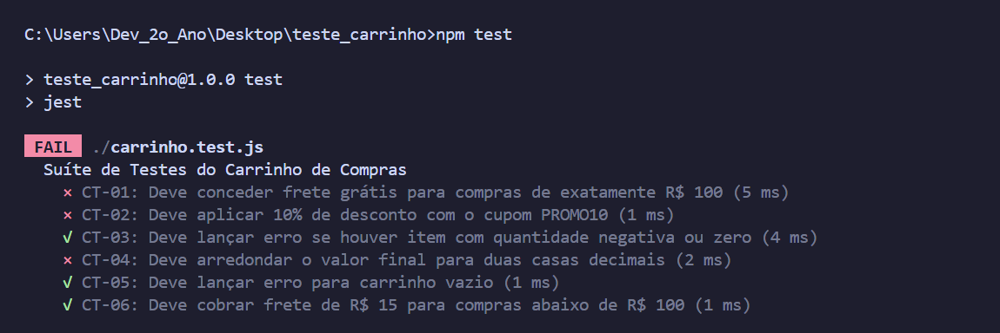
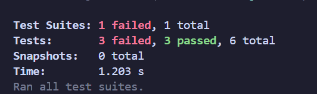
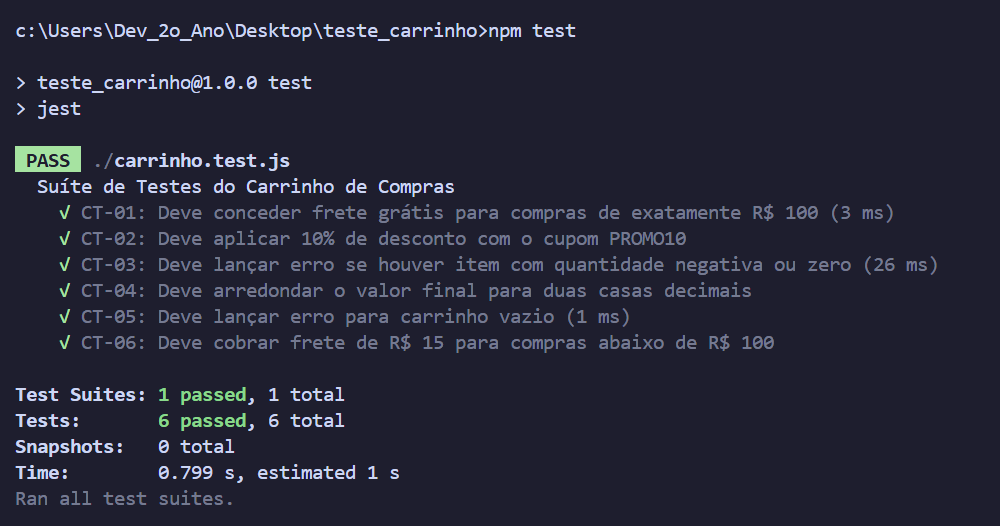

# Plano de Testes de Software & GOT

<p align="center">
  
  
  
  <br>
  
  
  
</p>

---

## O que é este projeto?

Este projeto é um exercício de **Engenharia de Testes de Software**, focado na elaboração de um **Plano de Testes** e de uma **Matriz do GOT (Guia de Ordem de Testes)** aplicados sobre o módulo de **Checkout de um e-commerce**.

O código-fonte (`carrinho.js`) implementa a função `calcularTotal(itens, cupom)`, que inicialmente continha **4 bugs propositais** de regra de negócio. A partir dos casos de teste da Matriz do GOT, os bugs foram identificados, migrados para uma **suíte automatizada com Jest** e, em seguida, **corrigidos** — com todos os testes voltando a passar.

Projeto desenvolvido como **exercício acadêmico/portfólio pessoal**, demonstrando o ciclo completo de teste de software: planejamento → execução manual → automação → identificação de falhas → correção → reexecução.

---

## O que ele entrega?

### Documentação (`docs/`)
- **Plano de Testes de Software & GOT** com identificação do projeto, escopo, regras de negócio e matriz de rastreabilidade *(em processo de atualização com os novos resultados via Jest)*
- Capturas de tela de cada etapa do processo de teste (caixa preta manual → Jest com falhas → correção → Jest 100% passando)

### Código (`carrinho.js`, `index.js`, `carrinho.test.js`)
- `carrinho.js`: função `calcularTotal`, já **corrigida**
- `index.js`: execução manual dos 6 casos de teste via `console.log` (versão caixa preta original)
- `carrinho.test.js`: **suíte automatizada em Jest** com os mesmos 6 casos de teste (CT-01 a CT-06)

---

## Regras de negócio do sistema

A função `calcularTotal(itens, cupom)` segue as seguintes regras:

- **Cálculo de subtotal:** multiplicar quantidade × preço de cada item.
- **Validação de entrada:** se o carrinho estiver vazio (`[]`), ou se algum item tiver quantidade `<= 0`, preço negativo ou valor não numérico, a função deve lançar o erro `"Carrinho inválido"`.
- **Desconto de cupom:** se o cupom for `"PROMO10"`, aplicar **10% de desconto** sobre o subtotal.
- **Regra de frete:**
  - Subtotal **>= R$ 100,00** → frete **grátis** (R$ 0,00);
  - Subtotal **< R$ 100,00** → frete de **R$ 15,00**.
- **Arredondamento:** o valor total final deve ter exatamente **2 casas decimais**.

---

## Evolução dos testes: caixa preta manual → Jest → correção

### 1ª etapa — Testes manuais (caixa preta)

Execução inicial via `console.log` em `index.js`, comparando o resultado esperado com o obtido:

<p align="center">
  
</p>

### 2ª etapa — Migração para Jest (revelando os bugs)

Os mesmos 6 casos de teste foram reescritos como uma suíte automatizada (`carrinho.test.js`) com `npm test`. Rodando contra o código **ainda com bugs**, o Jest confirma exatamente as falhas já mapeadas na Matriz do GOT:

<p align="center">
  
</p>

<p align="center">
  
</p>

| ID | Cenário | Status (antes da correção) |
|----|---------|------------------------------|
| CT-01 | Frete grátis exato na borda (subtotal = 100) | ❌ Falhou |
| CT-02 | Cupom PROMO10 (10% de desconto) | ❌ Falhou |
| CT-03 | Quantidade negativa | ✅ Passou |
| CT-04 | Arredondamento (2 casas decimais) | ❌ Falhou |
| CT-05 | Carrinho vazio | ✅ Passou |
| CT-06 | Frete pago (subtotal < 100) | ✅ Passou |

**Resultado:** 3 testes falharam, 3 passaram, de 6 no total — confirmando os bugs 2, 3 e 4 descritos abaixo.

### 3ª etapa — Correção dos bugs e reexecução

Após corrigir `carrinho.js`, a suíte Jest foi executada novamente e **todos os 6 testes passaram**:

<p align="center">
  
</p>

---

## Bugs encontrados e como foram corrigidos

| # | Bug (antes) | Correção (depois) |
|---|-------------|---------------------|
| 1 | Não validava `quantidade <= 0`, `preco < 0` nem valores não numéricos item a item | Validação item a item com `Number.isFinite()` e checagem de `preco < 0` / `quantidade <= 0`, lançando `"Carrinho inválido"` |
| 2 | Cupom `"PROMO10"` descontava **R$ 10,00 fixos** em vez de **10%** | Desconto passou a ser calculado como `subtotal * 0.10` |
| 3 | Condição de frete grátis usava `>` em vez de `>=`, cobrando frete indevido em exatamente R$ 100 | Condição corrigida para `subtotal >= 100` |
| 4 | Resultado final não era arredondado, retornando dízimas (ex: `48.3333`) | Retorno agora passa por `Number(total.toFixed(2))`, garantindo 2 casas decimais |

---

## Stack Tecnológica

| Camada | Tecnologia |
|--------|-----------|
| Runtime | Node.js 24.12.0 |
| Linguagem | JavaScript (CommonJS) |
| Framework de Testes | Jest |
| Estratégia de Teste | Caixa preta manual → testes automatizados |
| Documentação | Microsoft Word (.docx) — Plano de Testes & Matriz do GOT |

---

## Estrutura do Projeto

```
teste_carrinho/
├── docs/
│   ├── captura1.png     Execução manual (caixa preta) no terminal
│   ├── captura2.png     Jest FAIL - testes revelando os bugs
│   ├── captura3.png     Resumo Jest com falhas (3 failed, 3 passed)
│   └── captura4.png     Jest PASS - todos os testes passando após correção
├── carrinho.js          Função calcularTotal (já corrigida)
├── index.js             Execução manual dos 6 casos de teste (CT-01 a CT-06)
├── carrinho.test.js     Suíte automatizada em Jest (CT-01 a CT-06)
├── package.json
└── README.md
```

---

## Como Rodar

### Pré-requisitos
- Node.js instalado (v18+)

### 1. Clone e instale as dependências

```bash
git clone https://github.com/Breno-J-Oliveira/Plano-de-Testes-de-Software-GOT.git
cd Plano-de-Testes-de-Software-GOT
npm install
```

### 2. Rode a suíte de testes automatizada (Jest)

```bash
npm test
```

### 3. (Opcional) Rode a versão manual de caixa preta

```bash
node index.js
```

---

## Nota sobre a documentação

O documento `Plano de Testes de Software & GOT.docx` (Matriz do GOT completa) ainda reflete a **primeira rodada de testes manuais**. Ele será atualizado em breve para incluir a suíte Jest e os resultados finais pós-correção mostrados neste README.

---

## Contatos e Redes Sociais

<p align="center">
  <a href="https://github.com/Breno-J-Oliveira" target="_blank">
    
  </a>
  <a href="https://www.linkedin.com/in/breno-j-oliveira-672619352/" target="_blank">
    
  </a>
  <a href="https://www.instagram.com/brenoov" target="_blank">
    
  </a>
  <a href="https://x.com/BrenoJOliveira_" target="_blank">
    
  </a>
</p>
